# 📘 GoodDeeds2.0 – A Social Platform That Celebrates Kindness

Presenting one of my first personal projects, this one started with a simple thought:  
> **What if social media rewarded value—not virality?**

In today's world, popularity often defines worth. The most outrageous or entertaining content gets attention, while everyday acts of kindness—planting a tree, feeding a stray dog, helping someone cross the street—go unnoticed, labeled as “boring” or “0 views/likes”.

**GoodDeeds2.0** is my attempt to shift that culture.  
To build something that feels like social media—endless scrolling, likes, profiles, stats—but **makes users feel fulfilled, and the world a better place**, not just entertained.

A place where **every good deed is appreciated**, no matter how small or grand. Whether you're donating old clothes or innovating for climate change, you deserve to be seen, encouraged, and remembered.

---

## 💡 Why I Built This

I wanted to create a platform that:

- **Looks and feels like social media** – because that’s what users are familiar with.
- **Rewards real-world good** – protecting environment, helping others.
- **Builds a culture of contribution** – not comparison.

---

## ✨ Core Features

- 🔁 **Infinite Explore Feed** – discover inspiring deeds from people around the world
- 💬 **Like & Save** – so every user feels seen and appreciated
- 🏆 **Dashboard** – track your good deeds, coins, and positive impact
- 🎯 **Weekly Targets** – nudges to take action on real issues (e.g. donate masks,sanitizers during COVID)
- 🧠 **Gemini-Powered Chatbot** – gives ideas on how to help others or start a good deed
- 📱 **Fully responsive** – works on mobile, tablet, and desktop

This isn’t just a project—it’s a vision for a **kinder internet**. One where value isn’t defined by trends, but by **the good you bring into the world**.

---

## 🚀 Tech Stack

### Frontend:
- **React 19**
- **TypeScript**
- **Vite**
- **Tailwind CSS 4**
- **Shadcn/UI**
- **React Router DOM**
- **Appwrite** (Auth, DB, Storage)

---

## 📁 Project Structure:
GoodDeeds2.0/
├── public/
│   └── vite.svg
├── src/
│   ├── _auth/
│   │   └── Login.tsx
│   ├── _root/
│   │   └── RootLayout.tsx
│   ├── assets/
│   ├── components/
│   │   ├── cards/
│   │   │   ├── PostCard.tsx
│   │   │   └── UserCard.tsx
│   │   ├── forms/
│   │   │   ├── PostForm.tsx
│   │   │   └── ChatForm.tsx
│   │   ├── shared/
│   │   │   ├── PostStats.tsx
│   │   │   └── Sidebar.tsx
│   │   └── ui/
│   │       ├── alert-dialog.tsx
│   │       ├── avatar.tsx
│   │       ├── button.tsx
│   │       ├── card.tsx
│   │       ├── input.tsx
│   │       ├── select.tsx
│   │       ├── tabs.tsx
│   │       └── textarea.tsx
│   ├── context/
│   │   └── AuthContext.tsx
│   ├── helpers/
│   │   └── constants.ts
│   ├── lib/
│   │   └── appwrite.ts
│   ├── pages/
│   │   ├── CreatePost.tsx
│   │   ├── Explore.tsx
│   │   ├── Home.tsx
│   │   ├── PostDetails.tsx
│   │   ├── Profile.tsx
│   │   ├── Saved.tsx
│   │   └── Targets.tsx
│   ├── App.tsx
│   ├── main.tsx
│   └── global.css
├── .gitignore
├── index.html
├── package.json
├── tsconfig.json
├── vite.config.ts

---

## ▶️ Try It Out:
npm run dev

---

## 📸 Screenshots:

### Login Page
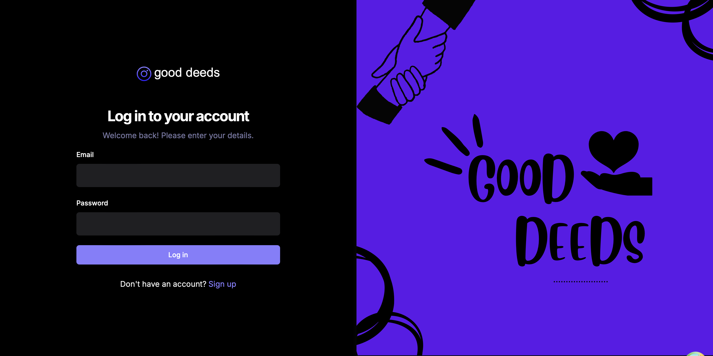

### Sign-up Page
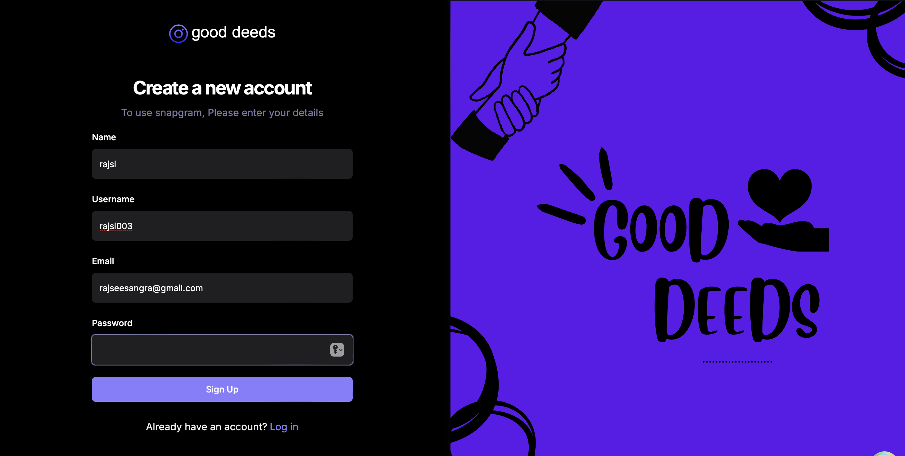

### Home
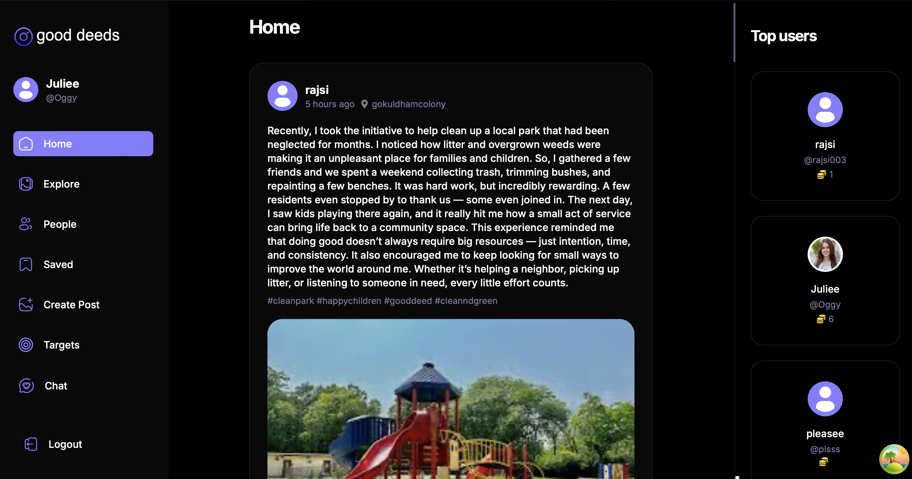

### Likes and Saved
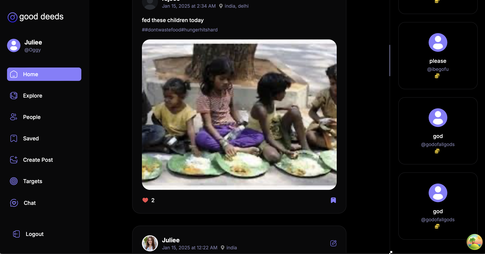

### Create Post
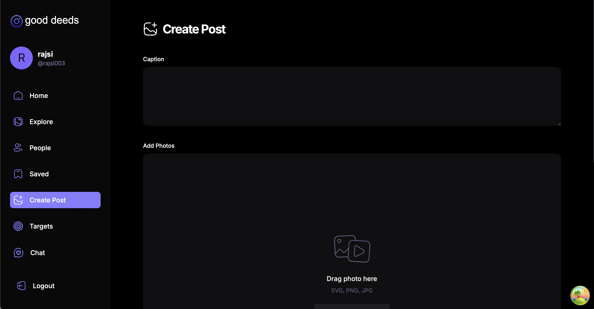

### Upload image
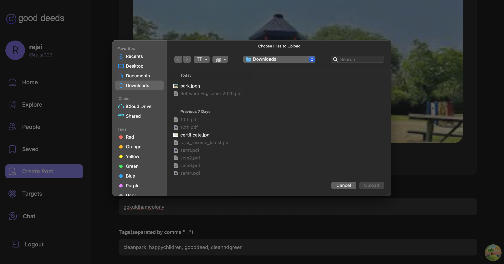
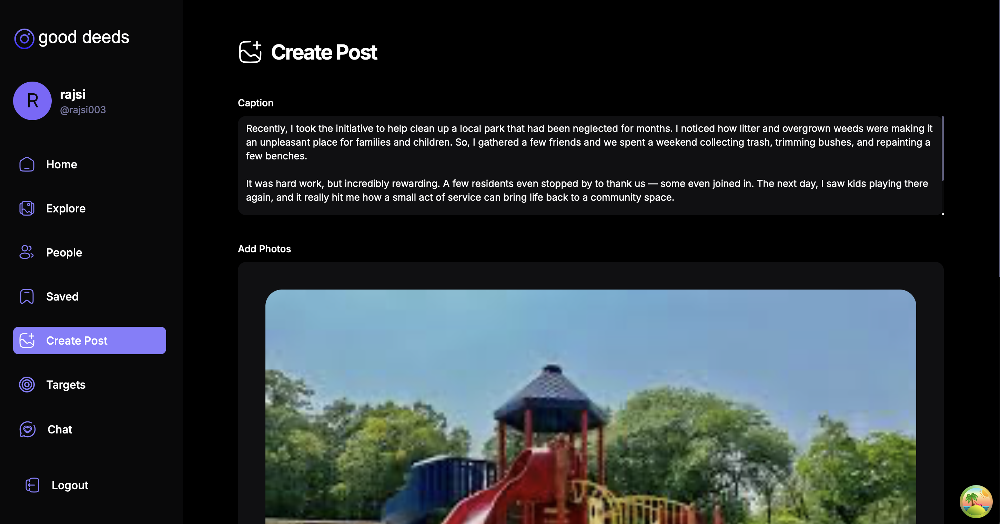
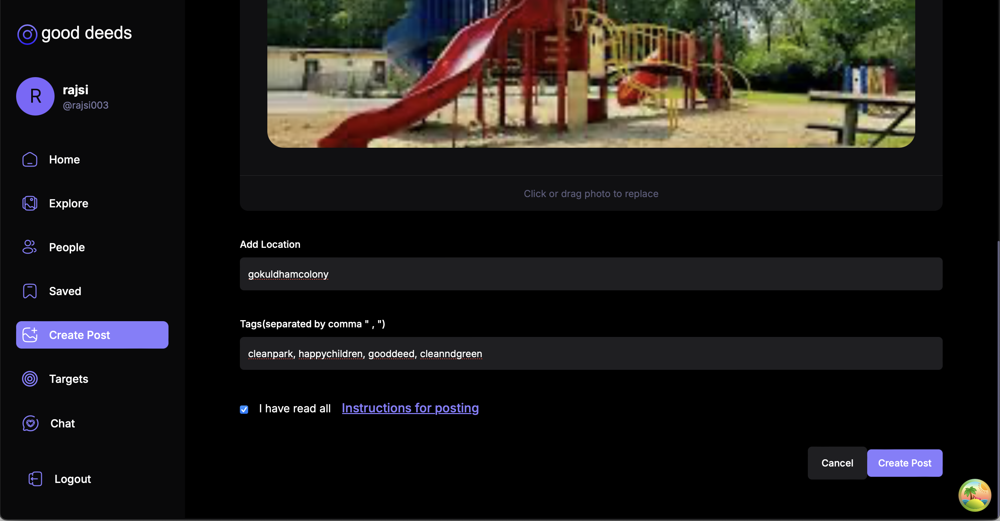

### GD 7.5

### Guildelines for post
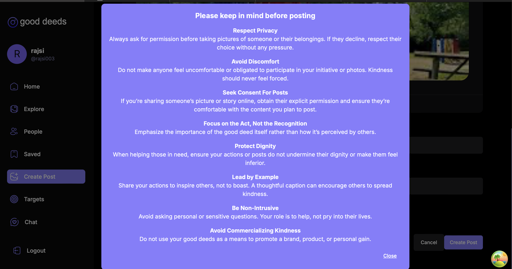

### Fellow users
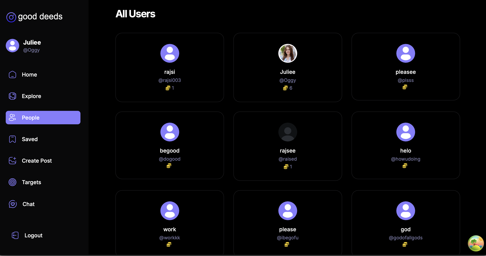

### Edit post
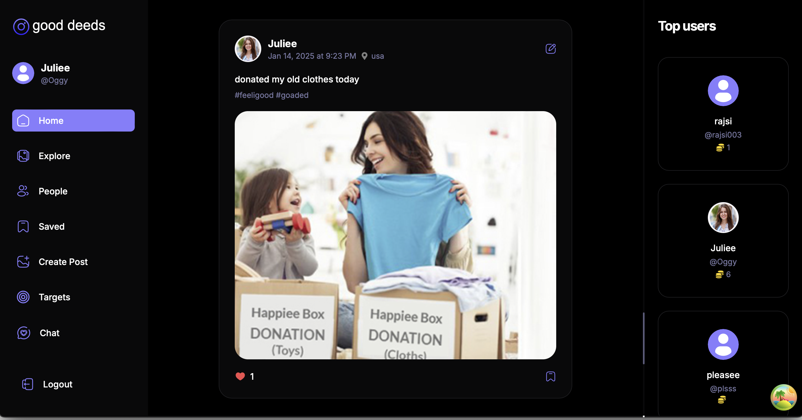
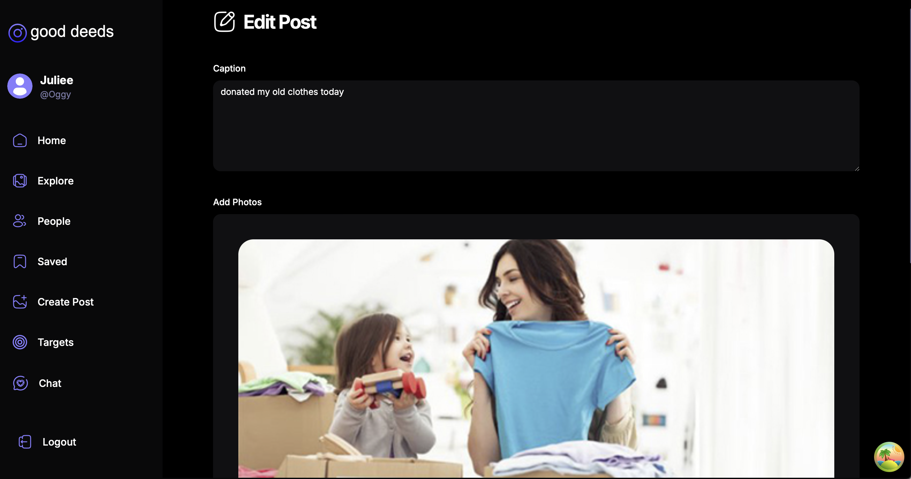
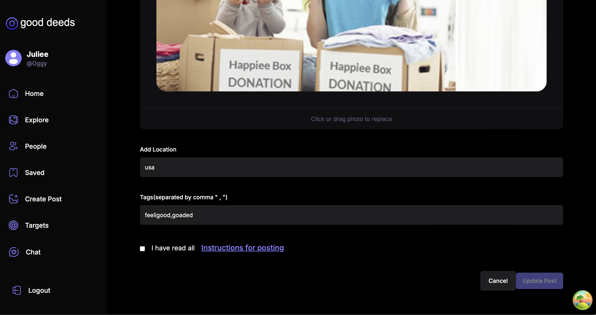

### Explore Page with Infinite Scroll
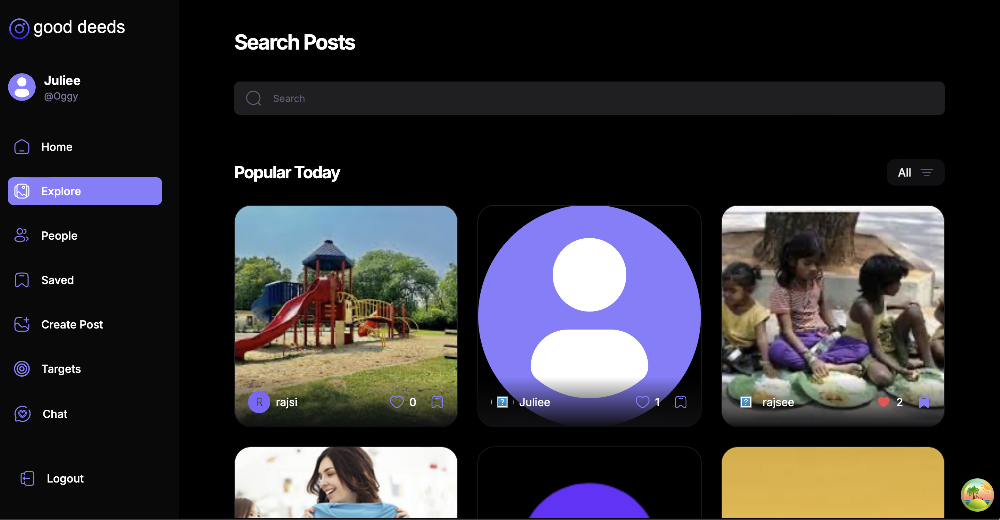

### Search Post by Caption/username
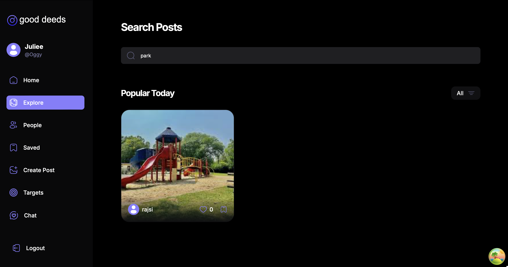

### Saved Posts
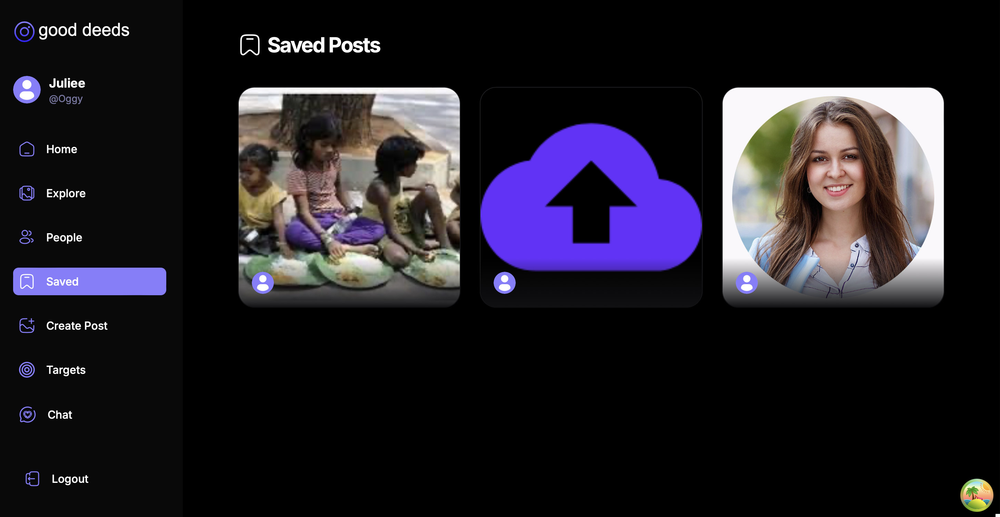

### View Profile
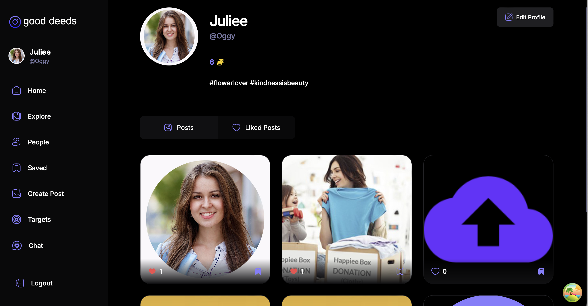

### Edit Profile

### Targets
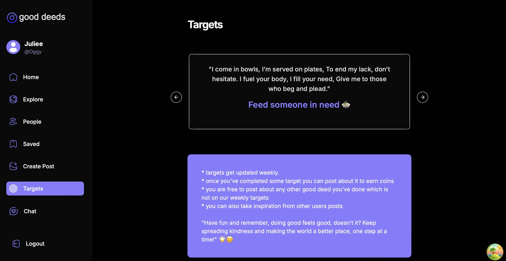

### ChatBot
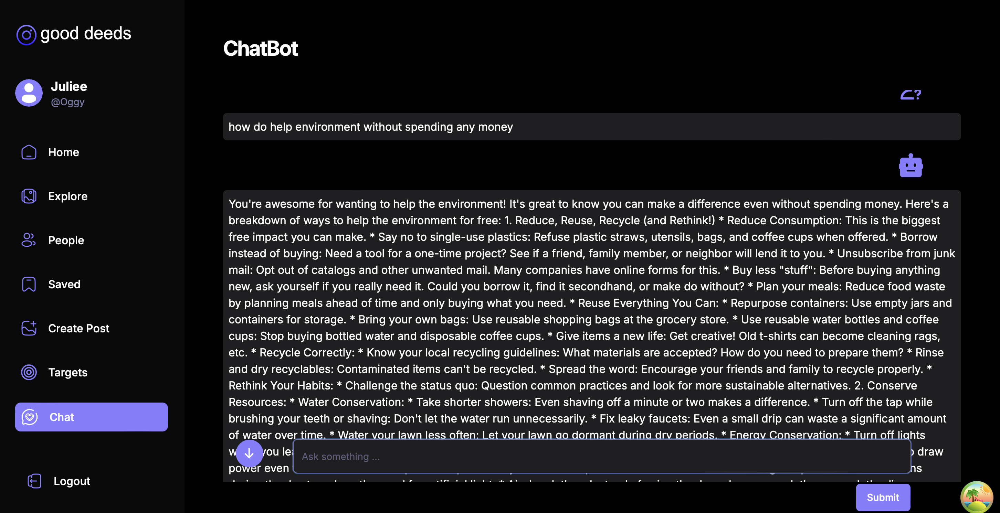
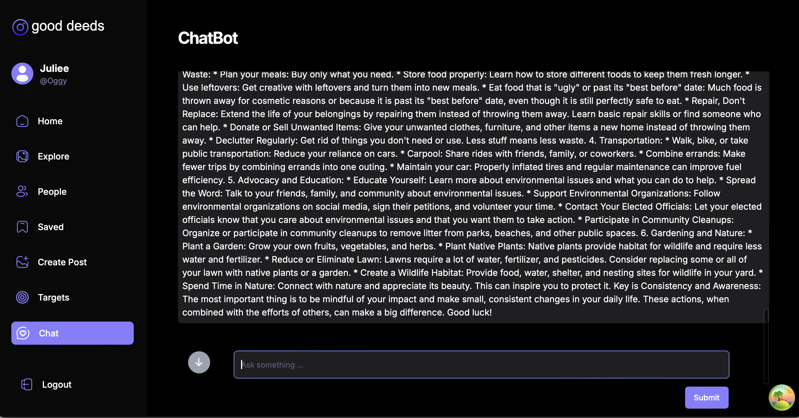

